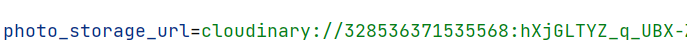

# Documentation

## 1. Introduction

This project create a website base on [Reddit](https://www.reddit.com), a social network platform. The website focus on allowing everyone to share their contents with each other, and express their opinion.  

## 2. Technologies

- The website use [Angular](https://angular.dev) for the front-end, and [Spring](https://spring.io) for back-end.
- [PostgreSQl](https://www.postgresql.org) is used to store data about users, posts, and communities.
- [MongoDB](https://www.mongodb.com) is used to store data about comments.
- [Cloudary](https://cloudinary.com) is used to store images and videos use in posts and communities.
- This repository is the back-end part of the project. The front-end part can be found here: [front-end](https://github.com/Trxyzng37/angular)

## 3. Functions

The website has the following functions:
- User can sign-up and sign-in using username password, or using Google account.
- User can create, edit, delete posts, communities and comments.
- User can search for communities or other people using name.
- User can sort posts's order base on time and upvote numbers.
- User can upvote or downvote a post, and save post to view later.
- Moderator of a community can control either a post is allowed or not in a community.

*Community*: community is a place where user can submit content that follow the community's interest. A community is created by a user, and the user is also have the ability to control which content can be shown on the community by moderate it.

*Post*: post is a piece of content that is submitted to the website. A post can be text, image, video or link. post can be created and submitted to a community by any user.

## 4. Running the application

Clone the repository:
`git clone https://github.com/Trxyzng37/spring.git`

Go to master branch:
`git checkout master`

Build the application into jar file:
`mvn package`

The above command will build the application using development environment.

You can run the application locally using the pre-build jar file name **TRXYZNG-1.1.jar** in the **document** folder. With this option, all the databases and storage has been set up and will be shared with everyone. The address of the application is: [http://127.0.0.1:8080](http://127.0.0.1:8080)

If you want to set up the application using your own databases and storage, follow the below steps.

#### 1. Database connection

This project use 2 databases.

- PostgreSQL database for storing data, including user, post and community's data.
- Mongo database to store comment's data.

1. PostgreSQL database

- Create a PostgreSQL database.
- Go to **document** folder and run the **schema.sql** script on your database to create schema and tables. Run the **data.sql** script on your database to create example data. 
- Go to **src/resources/application-dev.properties**, replace the below information with your database detail:

2. Mongo database 

- Go to **src/resources/application-dev.properties**, replace the below information with your mongo database detail:

#### 2. Image and video storage

All images and videos for posts are stored using **Cloudary**. 

- Click [here](https://cloudinary.com) to go to their website. 
- Sign-up for an account and generate new API key.

- Go to **src/resources/application-dev.properties**, replace the below information with your API key:

